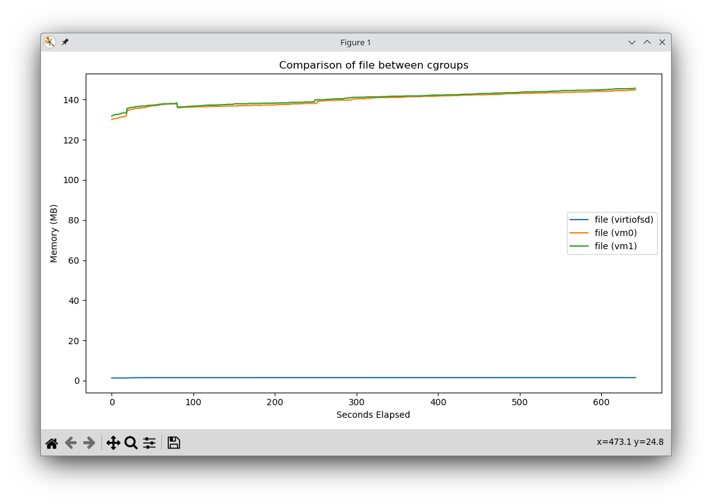

- AMD EPYC 4th gen, 4 NUMA nodes 128GB each
- Samsung CXL 128GB Memory Expander, 17.5GB/s
- Storage: Seagate BarraCuda hard drive 4TB 5400RPM, 120MB/s

# virtiofsd on CXL
---
- virtiofsd -o cache={none|always} pinned on CXL, exporting /dev/sdb3
- 32 GB guest V,  cpu+memory pinned on NUMA node 1
- fio 8 threads x 8GB --direct=0 --invalidate=0
- Hyperthreading: off
- Autonuma: off
- cpufreq: performance
- hugepages: 1G
****

| Run          | First run | Second run | Third run | Fourth run | file cache size at end of tests |
| ------------ | --------- | ---------- | --------- | ---------- | ------------------------------- |
| cache=none   | 89MB/s    | 2GB/s      | 5.1GB/s   | 5.1GB/s    | 180MiB                          |
| cache=always | 70MB/s    | 172MB/s    | 30GB/s    | 32GB/s     | 8GB                             |

NB: no invalidation or drop_cache between the runs

# Paper Experiments
---
- Each experiment has a throughput table and includes a graph of the evolution of the amount of file pages `file` on the host (`virtiofsd`) and the two guests (`vm0` and `vm1`) 

- The job file used is https://github.com/karim-manaouil/virtiofs-cxl-experiments/blob/main/fio/jobs/job8-8-4k-1g.fio
- In short, it creates 8 jobs, each accessing 8x1G files (64G in total). 

- The files are created with `filectl` and distributed across DRAM/CXL
    - Up until experiment 4, everything goes to DRAM, as CXL is not yet introduced.
    - Starting from experiment 5, CXL is introduced and file are distributed with x1.5/x0.5 DRAM/CXL (hot/cold) ratios.

- Guest caching knob is controlled from `virtiofsd` with `-o cache` option.

- fio accesses the files following a zipfian distribution.
## Experiment 1)
---
2 VMs, each one reading the same file over virtiofs, cache=None, O_DIRECT (no host no guest)

| VM    | VM0      | VM1      |
| ----- | -------- | -------- |
| run 1 | 1565MB/s | 1565MB/s |
| run 2 | 1734MB/s | 1734MB/s |

## Experiment 2)
---
2 VMs, each one reading the same file over virtiofs, cache=Always, (just guest no host)

NEED TO TALK TO SHAI ABOUT (just guest no host)

## Experiment 3)
---
2 VMs, each one reading the same file over virtiofs, cache=Always, (Guest and host)
- 64G zipf
- Host caching: yes
- Guest caching: yes
- Cache: 100% DRAM

| First touch  | 126GB/s |
| ------------ | ------- |
| Second touch | 130GB/s |
## DAX (experiments >=4)
---
2 VMs, each one reading the same file over virtiofs, cache=Always, DAX
- 64G zipf
- Host caching: no (DAX)
- Guest caching: yes 
- Cache: CXL + DRAM with ratios

- I show aggregate (vm0+vm1) throughput (per VM is always aggregate divided by two)
- This requires a kernel modification. Our patches can be found at [1] for akpm's Linux kernel v6.13-rc6 mm-stable branch.

| CXL Ratio    | 100%     | 80%      | 50%      | 30%      | 20%      | 10%     | 5%      | 0%      |
| ------------ | -------- | -------- | -------- | -------- | -------- | ------- | ------- | ------- |
| First touch  | 17.4GB/s | 21.9GB/s | 35.5GB/s | 59.9GB/s | 82.2GB/s | 101GB/s | 107GB/s | 110GB/s |
| Second touch | 17.4GB/s | 22.1GB/s | 35.7GB/s | 60GB/s   | 83.9GB/s | 104GB/s | 110GB/s | 113GB/s |

# Refs
---
[1] https://github.com/karim-manaouil/virtiofs-cxl-experiments/tree/main/patches